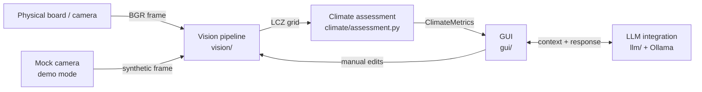
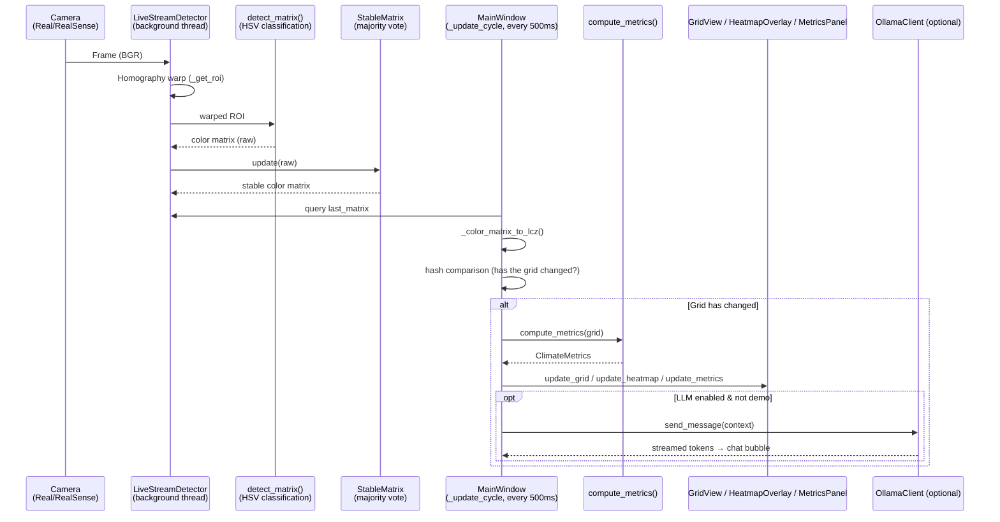
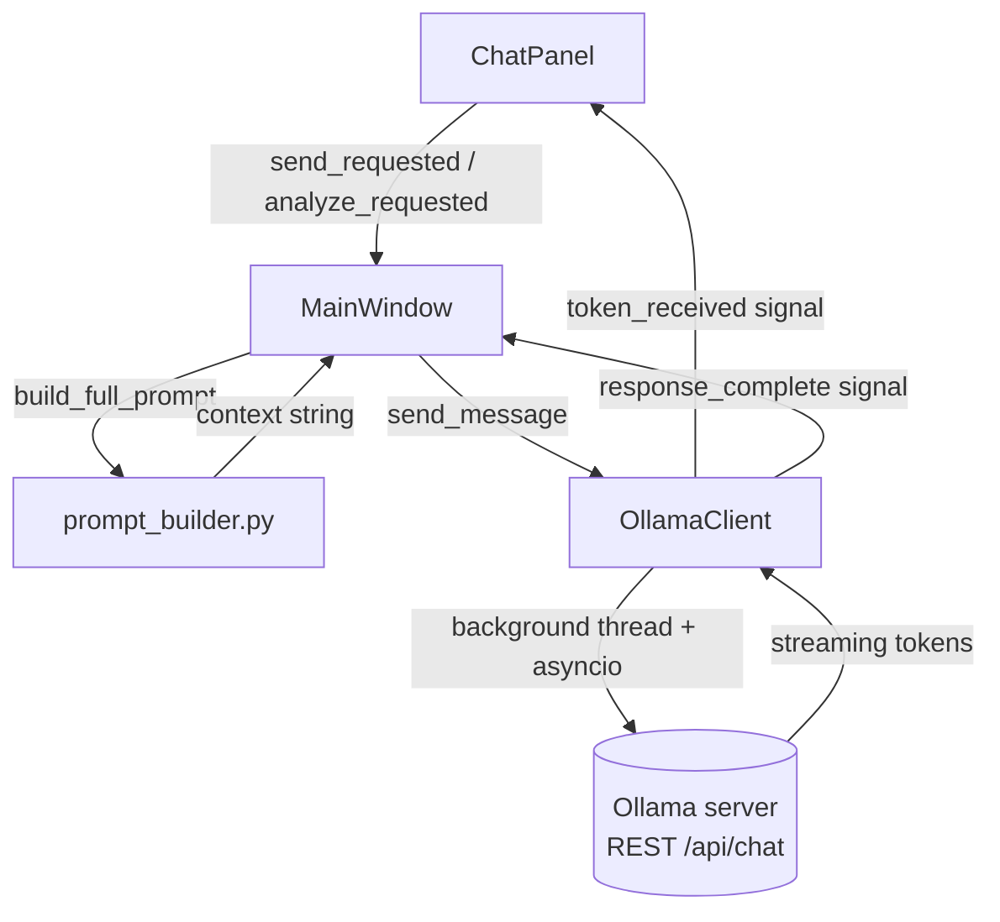
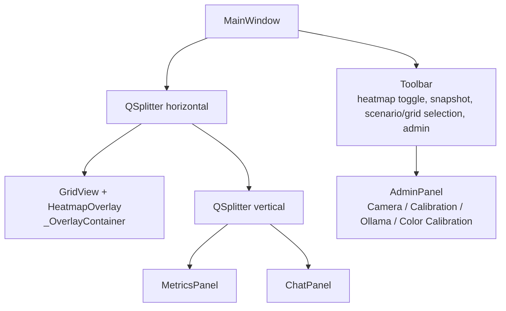

# CityClimate Board — System Architecture

Research Seminar, Summer Term 2026 · TH Köln
Team: Alessio Fiorito, Bakir Ahmetbegovic, Segmen Bagcivan

This document describes the current architecture of the CityClimate Board
prototype (a runnable prototype with demo mode, optional camera
integration, and optional Ollama LLM integration).

---

## 1. Overview

CityClimate Board is a tangible urban-planning tool: tiles colored according to
Local Climate Zones (LCZ) are placed on a physical 5×5 grid. A camera (or, in
demo mode, a synthetic frame) captures the grid, a computer-vision pipeline
detects the tile colors, a climate model is computed from that (Heat Exposure,
temperature, population, green/built fraction), and the result is displayed in
a PyQt6 interface with a grid view, a temperature heatmap, a KPI panel, and an
Ollama-powered chat assistant.



**Core principle:** the camera classes (`MockCamera`, `RealCamera`,
`RealSenseCamera`) are interchangeable and expose the same interface
(`get_frame`, `get_grid`, `set_grid`, `update_cell`, `is_open`, `release`). This
lets `main.py` swap in the appropriate implementation based on the CLI flag
(`--demo` / `--camera` / `--realsense`) without the GUI or the climate
assessment needing to know which one is in use.

---

## 2. Module Overview

| Path | Responsibility |
|---|---|
| `config.py` | Global configuration: grid dimensions, LCZ class table (temperature, population density, cooling, SVF, colors), color→LCZ mapping, KPI value ranges, GUI theme |
| `main.py` | CLI entry point: argument parsing, camera selection, starting the PyQt6 app |
| `test_llm.py` | Standalone CLI tester for the LLM pipeline (without GUI/camera) |
| `climate/assessment.py` | Cooling propagation + Heat Exposure/metrics computation (`apply_cooling`, `compute_metrics`, `ClimateMetrics`) |
| `vision/cv_live_stream.py` | **Central** CV pipeline: homography warp, HSV color classification, `StableMatrix` (majority vote across frames), `LiveStreamDetector` (background thread) |
| `vision/cv_snapshot.py` | Single-frame detection (`SnapshotDetector`) for the "Snapshot" button |
| `vision/calibration.py` | Homography computation from 4 corner points, saving/loading `calibration.json` |
| `vision/grid_extractor.py` | Legacy stub; `extract_grid()` is used by `RealCamera._extract_via_cv()` (warp + classification in a single call) |
| `vision/color_classifier.py` | Legacy stub, pure re-exports from `cv_live_stream` |
| `camera/mock_camera.py` | Software camera: renders the logical grid directly as a synthetic frame (demo mode) |
| `camera/real_camera.py` | Real webcam via `cv2.VideoCapture`, dedicated grab thread, thread-safe frame cache |
| `camera/realsense_camera.py` | Intel RealSense RGB stream via `pyrealsense2`, API-compatible with `RealCamera` |
| `gui/app.py` | `MainWindow` — wires up the camera/CV pipeline, metrics, all panels, the update cycle, and scenario/planning logic |
| `gui/admin_panel.py` | Admin dialog: camera selection, calibration, Ollama/SSH settings, HSV color calibration |
| `gui/grid_view.py` | 2D grid rendering with LCZ colors/icons, hover tooltips, right-click context menu |
| `gui/heatmap_view.py` | Transparent temperature overlay (geometry-aligned with `GridView`) |
| `gui/metrics_panel.py` | KPI cards (Heat Exposure, temperature, population, green/built fraction) + LCZ distribution chart (Matplotlib) |
| `gui/chat_panel.py` | Chat UI with message history, analyze button, online/offline status |
| `llm/ollama_client.py` | Async Ollama REST client (`OllamaClient`), streaming via Qt signals, runs on a background thread |
| `llm/prompt_builder.py` | Static system prompt + dynamic context block (grid table, metrics, scenario progress/hints) |
| `llm/matrix_context.py` | `MatrixContext` dataclass: snapshot of grid + metrics + timestamp + source |
| `tests/sample_grids.py` | Predefined demo grids (`DEMO_GRIDS`) and guided scenarios (`SCENARIOS`) |
| `tools/hsv_logger.py` | Interactive diagnostic tool for HSV calibration with ground-truth labeling |
| `tools/scan_cameras.py` | Scans camera indices 0–9 and saves one test image per device found |
| `tools/realsense_test.py` | Quick test: grabs one frame from the RealSense and saves it |

---

## 3. Data Flow — Live Detection Cycle

The central cycle, which runs roughly every 33 ms in the `LiveStreamDetector`
background thread (in live mode, not demo) until an update is passed on to the
GUI via a `QTimer` (500 ms):



**Stabilization:** `StableMatrix` prevents flicker caused by camera noise — a
cell is only considered changed once the same color has been detected at least
`STABLE_THRESHOLD = 10` times within a ring buffer of the last
`STABLE_WINDOW = 15` frames.

**Manual edits** (left-click to select, right-click context menu in
`GridView`) bypass the CV path entirely and go directly through
`MainWindow._on_cell_changed()`, updating camera state, metrics, and the GUI
synchronously.

---

## 4. Configuration (`config.py`)

All of the system's tunable parameters are centralized in `config.py`:

- **Grid:** `GRID_ROWS`/`GRID_COLS` (5×5), `CELL_AREA_KM2` (0.25 km² per cell)
- **LCZ class table (`LCZ_CLASSES`):** per class (`2`, `5`, `6`, `9`, `A`, `D`,
  `G`, …) — name, relative temperature, population density, cooling effect,
  height, imperviousness, sky view factor, and HSV values derived automatically
  from the reference hex color (`_hex_to_hsv`)
- **`COLOR_TO_LCZ`:** maps a detected tile color (e.g. `"darkgreen"`) to an LCZ
  ID (e.g. `"A"`) — the **single source of truth**, mirrored by
  `cv_live_stream.py`
- **`LCZ_TILE_COLORS`:** display colors, identical between `GridView` and the
  distribution chart in `MetricsPanel`
- **`KPI_RANGES`:** reachable min/max values per metric (used for UI scaling)
- **`THEME`:** dark color scheme for all PyQt6 widgets
- Values for `rel_temp`, `svf`, `impervious`, `pop_density`, and `cooling` are
  based on the scientific literature — see the paper for details.

---

## 5. Vision Pipeline

### 5.1 Calibration (`vision/calibration.py` + Admin Panel "Calibration" tab)

1. The user clicks the 4 corners of the physical board in the Admin Panel, in
   order: top-left → top-right → bottom-right → bottom-left.
2. `compute_homography()` uses `cv2.findHomography()` to compute a 3×3 matrix
   that maps the clicked points onto the canonical rectangle
   (`BOARD_WIDTH_PX` × `BOARD_HEIGHT_PX`, default 800×800 px).
3. `save_calibration()` persists the matrix to `calibration.json`.
4. All subsequent frames are rectified onto this canonical view via
   `apply_homography_warp()` / `_get_roi()` before color detection runs.
   Without a calibration file, a simple center crop is used as a fallback.

### 5.2 Color Detection (`vision/cv_live_stream.py`)

- Each of the 5×5 cells is cropped to an inner region
  (`CELL_MARGIN = 0.15`, ignoring grid lines/shadows at the edges).
- For each defined color (`COLOR_RANGES`, loaded from `color_ranges.json` with
  a fallback to `_VALIDATED_DEFAULTS`), the fraction of pixels falling within
  the HSV range is computed (pixel-fraction voting); the color with the
  highest fraction above a minimum threshold (0.25) wins, otherwise the cell is
  classified as `"empty"`.
- `"red"` requires two HSV ranges (`red` + `red2`) because of the hue
  wraparound at 0°/179°.
- Colors can be individually disabled in the Admin Panel's "Color Calibration"
  tab (disabled colors are then treated as empty), and HSV ranges can be
  recomputed from clicked sample cells (`compute_ranges_from_samples`).

### 5.3 Live vs. Snapshot Detection

| | Live (`LiveStreamDetector`) | Snapshot (`SnapshotDetector`) |
|---|---|---|
| Trigger | continuous, background thread | one-shot, button click |
| Stabilization | `StableMatrix` (majority vote across multiple frames) | none — direct single-frame classification |
| Use case | ongoing operation in camera mode | quick capture without continuous operation, e.g. for screenshots |

### 5.4 Diagnostic Tool: HSV Logger (`tools/hsv_logger.py`)

An interactive OpenCV tool for collecting per-cell ground-truth labels,
computing the median/standard deviation per color, and automatically
suggesting new HSV ranges (median ± standard deviation + safety margin) —
output as a CSV log and a summary file in `logs/`.

---

## 6. Climate Assessment (`climate/assessment.py`)

**Step 1 — Cooling propagation (`apply_cooling`):**
Every cell starts at the base temperature of its LCZ class (`rel_temp`). Cells
with a cooling effect (e.g. trees, water) reduce the temperature of their four
orthogonal neighbors (Von Neumann neighborhood, no diagonals). If a cell
receives cooling from multiple sources, only the **strongest** effect counts
(no additive stacking).

**Step 2 — Heat Exposure (`compute_metrics`):**

```
HE = Σ(Pᵢ · Tᵢ) / Σ(Pᵢ)
```

where `Pᵢ` is the population density and `Tᵢ` is the (cooled) temperature of
cell `i`. If no cells are inhabited (`Σ Pᵢ = 0`), the calculation falls back to
the unweighted mean temperature.

Also computed: mean temperature, total population (`Σ Pᵢ × CELL_AREA_KM2`),
green fraction (LCZ `A`, `D`, `G`), and built fraction (LCZ `2`, `5`, `9`,
`10`).

*See the paper for the formal derivation and the underlying literature
values.*

---

## 7. LLM Integration (`llm/`)



- **`OllamaClient`** (`llm/ollama_client.py`) runs asynchronously on a
  background thread (its own `asyncio` event loop) so the GUI never blocks.
  Configuration is loaded from `llm_config.yaml` (falling back to `config.py`,
  then hardcoded defaults).
- **Context separation:** the static system prompt (role/format rules) and the
  current grid state are sent as **separate** system messages — the grid
  context is re-injected on every request and never cached from the
  conversation history, ensuring the model never reasons from a stale board
  state.
- **`prompt_builder.py`** builds the context block: the grid table, a list of
  occupied/empty cells, computed metrics, heatmap status, and — if a scenario
  is active — its progress plus staged hints (`SessionState.hint_level`,
  which automatically escalates after 3 moves without progress).
- **SSH tunnel (Admin Panel, "Ollama" tab):** since Ollama typically runs on a
  remote machine (e.g. Jetson/Spark), the user manually opens a terminal with
  `ssh -N -L <local_port>:localhost:11434 -p <port> <user>@<host>`; the Admin
  Panel then polls the local port until Ollama becomes reachable.

---

## 8. GUI Structure (`gui/`)



- **`MainWindow`** (`gui/app.py`) is the central coordinator: it wires up the
  camera, the CV detector, the climate assessment, all panels, and the Ollama
  client via Qt signals. It also manages the planning-task timer
  (`PlanningTimerWidget`, a 5-minute countdown with a results popup) and the
  scenario logic (`_activate_scenario`).
- **`GridView`** draws the tiles in their LCZ colors with icons, supports hover
  tooltips (name, ΔT, population density), and a right-click context menu for
  manually assigning a zone.
- **`HeatmapOverlay`** sits transparently on top of `GridView` and must mirror
  its geometry exactly (`_LABEL_MARGIN`) so that colored areas align pixel-
  perfectly with the tiles; the color scale uses the Matplotlib colormap
  `RdYlGn_r`.
- **`MetricsPanel`** shows the 5 core KPIs as cards (Heat Exposure
  traffic-light colored) plus an embedded Matplotlib bar chart of the zone
  distribution.
- **`ChatPanel`** manages the message history (last 6 exchanges), real-time
  streaming, and an online/offline banner.
- **`AdminPanel`** bundles four tabs: camera device selection/scan, board
  calibration (homography), Ollama/SSH connection settings, and HSV color
  calibration (snapshot mode, sample collection, a table with editable HSV
  bounds).

---
