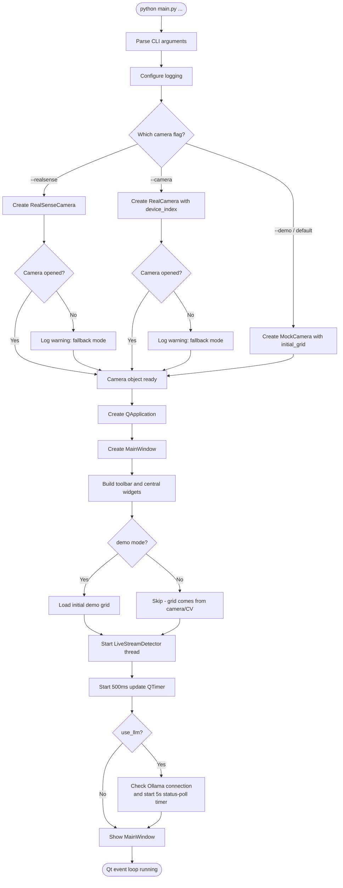
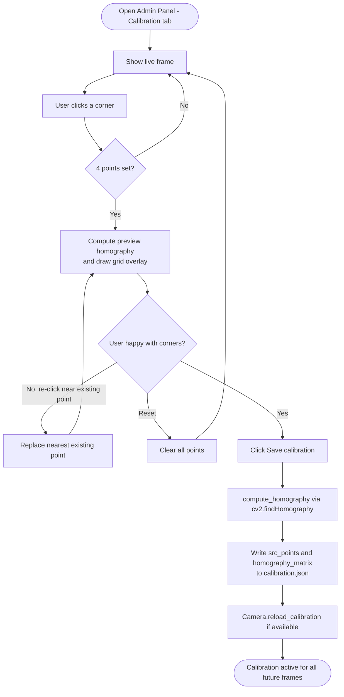
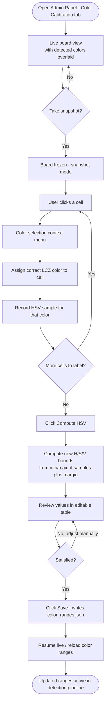
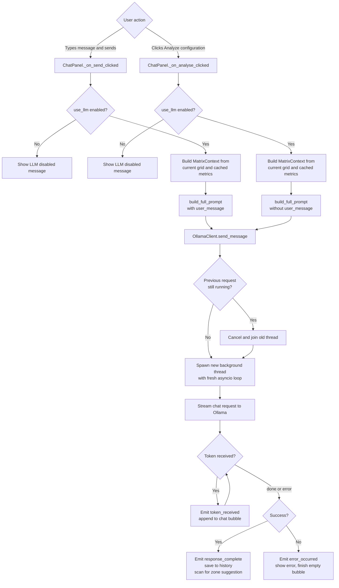
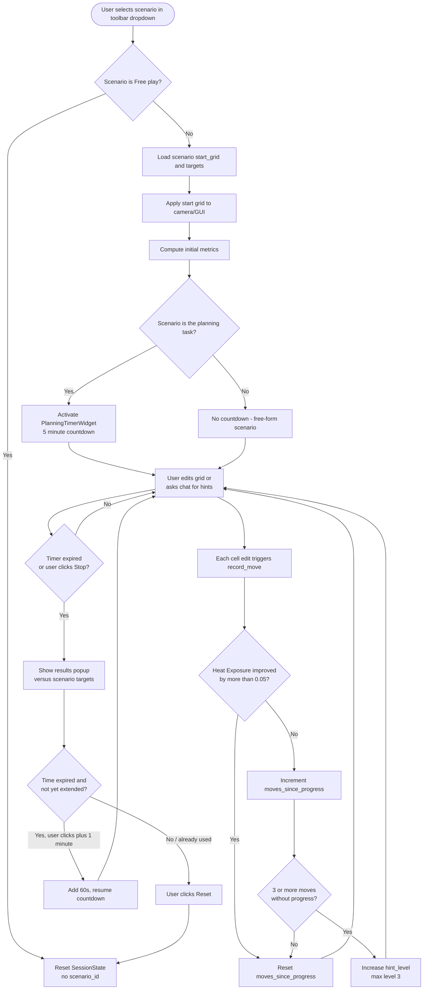

# CityClimate Board — Process Flowcharts

Research Seminar, Summer Term 2026 · TH Köln
Team: Alessio Fiorito, Bakir Ahmetbegovic, Segmen Bagcivan

This document collects the key process/decision flows of the CityClimate
Board application as flowcharts. For the system's static architecture and the
runtime *sequence* diagrams (live detection cycle, LLM request/response), see
[`architecture.md`](./architecture.md). For the physical setup, see
[`versuchsaufbau.md`](./versuchsaufbau.md).

## Contents

1. [Application Startup](#1-application-startup)
2. [Calibration Workflow](#2-calibration-workflow)
3. [Color Calibration Workflow](#3-color-calibration-workflow)
4. [Chat / LLM Request Decision Flow](#4-chat--llm-request-decision-flow)
5. [Scenario / Planning Task Lifecycle](#5-scenario--planning-task-lifecycle)

---

## 1. Application Startup

Covers `main.py` from process start to the running `MainWindow`, including the
camera-mode decision based on CLI flags (see `_build_camera()` and
`MainWindow.__init__()`).

**Notes:**
- Failure to open a real camera (RealSense or webcam) does **not** stop the
  app — it logs a warning and continues in a fallback/no-signal state so the
  user can still calibrate once a camera is connected, or fall back to
  `--demo`.
- `demo` in `MainWindow` is derived as `not (args.camera or args.realsense)`,
  i.e. `--demo` is effectively the default whenever no hardware flag is given.

---

## 2. Calibration Workflow

Covers the Admin Panel's Calibration tab (`gui/admin_panel.py`), i.e. how a
raw camera frame becomes a homography-corrected board view.

**Notes:**
- Corner order must be top-left → top-right → bottom-right → bottom-left; this
  order defines which board edge maps to which output edge.
- If `cv2.findHomography` is unavailable/fails, the panel falls back to an
  injected `compute_homography` callable, and finally to an identity matrix
  (with a warning shown to the user) rather than crashing.
- Loading an *existing* `calibration.json` (via "Load existing") re-populates
  the 4 corner points so they can be reviewed/adjusted without starting over.

---

## 3. Color Calibration Workflow

Covers the Admin Panel's Color Calibration tab, used to fine-tune the HSV
ranges the CV pipeline uses to classify tile colors.

**Notes:**
- Colors can also be individually **disabled** (treated as always empty)
  via checkboxes — persisted as the `_disabled` key in `color_ranges.json`.
- A "Reset to validated values" action restores the hand-tuned
  `_VALIDATED_DEFAULTS` baked into `vision/cv_live_stream.py`, discarding any
  custom samples/ranges.
- Saving triggers `MainWindow._reload_color_ranges()`, which also resets the
  live detector's `StableMatrix` buffer so stale frames don't linger.

---

## 4. Chat / LLM Request Decision Flow

Covers what happens between a user action in `ChatPanel` and a rendered
assistant response, focusing on the *branching* logic (LLM enabled/disabled,
manual question vs. automatic analysis).

**Notes:**
- The grid/metrics context is always rebuilt fresh at request time — never
  taken from the chat history — so recommendations are always grounded in the
  *current* board state (see `architecture.md`, "LLM Integration").
- `_on_llm_response_complete()` scans the finished response text for known LCZ
  zone keywords (German/English) to remember the model's most recent
  suggestion (`SessionState.last_suggestion`), so it can be referenced (and
  avoided as a repeat) in the next prompt.

---

## 5. Scenario / Planning Task Lifecycle

Covers selecting a guided scenario (or the open planning task), playing
through it, and reaching a result — spanning `gui/app.py`
(`_activate_scenario`, `PlanningTimerWidget`) and `llm/prompt_builder.py`
(`SessionState`, hint escalation).

**Notes:**
- The open-ended planning task (scenario `"P"`) has no fixed Heat
  Exposure/green-fraction target — success is judged only on population
  (at least 70,000) and industry tile count (at least 3), with Heat Exposure
  minimized as a secondary objective.
- Hint escalation (`hint_level` 1 to 3) makes the LLM's suggestions
  progressively more concrete (Tip → Direction → Concrete), see
  `SCENARIO_HINTS` / `HINT_FRAMING` in `llm/prompt_builder.py`.
- The one-time plus-1-minute extension is only offered once per task attempt
  (`SessionState`/`PlanningTimerWidget._extended` flag).
